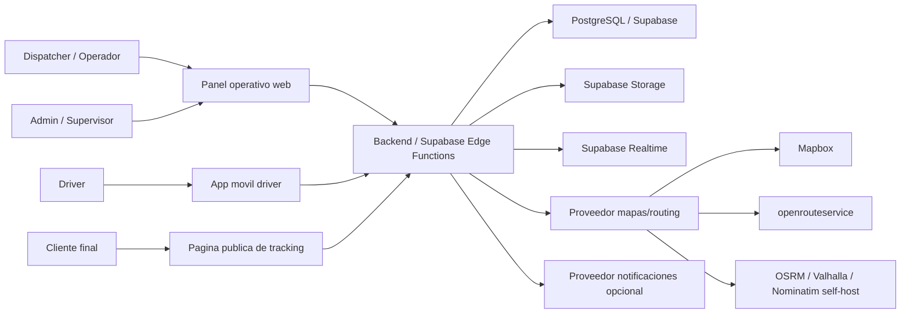
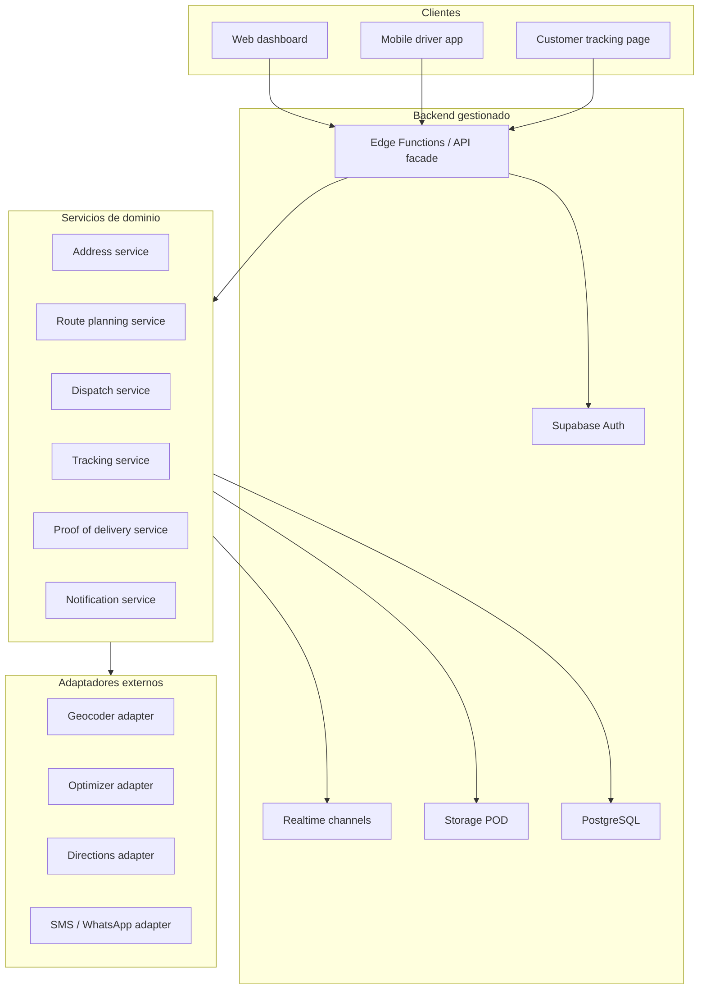
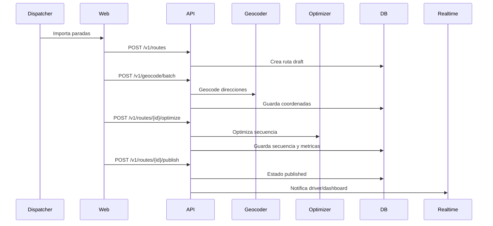
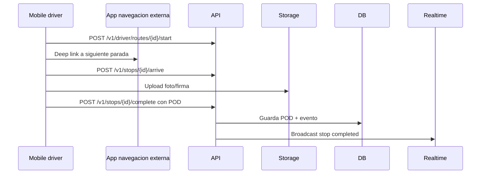

# 01 - Arquitectura

## Decision recomendada

Para la primera version se recomienda:

- App movil cross-platform para drivers.
- Panel web para dispatchers y admins.
- Supabase como backend gestionado: auth, PostgreSQL, realtime, storage y edge functions.
- Mapbox como proveedor principal gestionado para mapas, geocoding, directions y optimization.
- Adaptador alternativo para openrouteservice si se busca exprimir costo en MVP.
- Navegacion externa mediante deep links.

La arquitectura debe aislar el dominio de rutas de los proveedores de mapas para
poder migrar entre Mapbox, openrouteservice y self-host OSM sin reescribir la app.

## Stack por fase

| Fase | Stack | Motivo |
| --- | --- | --- |
| Fase 1 barata | Supabase + Mapbox u ORS + navegacion externa | Menor time-to-market y bajo costo variable |
| Fase 2 managed seria | Supabase + Mapbox + notificaciones controladas | Mejor cobertura, SDKs y menor operacion |
| Fase 3 escala/control | Supabase o backend propio + Valhalla/OSRM + Nominatim + MapLibre | Menor costo variable con mas DevOps |
| Fase 4 avanzada | Navigation SDK embebido o motor propio | Solo si la navegacion integrada aporta ROI |

## Reuso de repos (impacto en arquitectura)

Repos evaluados en [06-reuso-repos.md](docs/06-reuso-repos.md).

Reglas de arquitectura derivadas:

- El modelo VRP del dominio se benchmarkea contra escenarios tipo `googlemaps/js-route-optimization-app`, pero no se integra ese repo en ruta critica.
- El Route Builder adopta ideas de UX (capas, import/export) de `route-planner-vue`, con contrato JSON propio versionado.
- La navegacion externa se implementa por `NavigationAdapter` interno para no depender de una libreria RN antigua.
- Demos como `OpenMapsApp` y wrappers legacy iOS se usan solo como referencia de compatibilidad/esquemas.

## Vista de contexto



## Vista de contenedores



## Modulos

### Identity and tenancy

- Organizaciones, miembros, roles y permisos.
- Autenticacion Supabase.
- RLS obligatoria por `organization_id`.
- Roles minimos: `admin`, `dispatcher`, `driver`, `viewer`.

### Address

- Normalizacion de direcciones.
- Autocomplete.
- Geocoding y reverse geocoding.
- Cache interno de resultados permitidos por licencia.
- Registro de proveedor, confidence y raw response controlado.

### Route planning

- Creacion y edicion de rutas.
- Secuenciacion de paradas.
- Optimizacion single-vehicle en MVP.
- Multi-vehicle en fase 2.
- Persistencia de costos estimados: distancia, duracion, proveedor, parametros.

### Dispatch

- Publicacion de ruta.
- Asignacion a driver/vehiculo.
- Reasignacion de parada/ruta.
- Bloqueo de paradas ya completadas en replanificacion.

### Tracking

- Ingestion de ubicaciones GPS.
- Ultima posicion por driver.
- Historial durante ruta activa.
- Broadcast al panel operativo.
- Politica de retencion para datos crudos.

### Proof of Delivery

- Fotos, firmas, notas, timestamp y coordenadas.
- Upload directo o firmado a storage.
- Validacion de tipo y peso de archivo.
- Asociacion con evento terminal de parada.

### Notifications

- Eventos internos primero.
- Email/push antes que SMS/WhatsApp si el costo importa.
- SMS/WhatsApp con feature flag y presupuesto mensual.

## Interfaces de proveedor

El dominio no debe llamar Mapbox u ORS directamente. Debe depender de interfaces:

```ts
type Coordinates = {
  lat: number;
  lng: number;
};

type GeocodeCandidate = {
  label: string;
  coordinates: Coordinates;
  confidence?: number;
  provider: "mapbox" | "ors" | "nominatim";
  providerPlaceId?: string;
};

type OptimizeRouteInput = {
  depot?: Coordinates;
  stops: Array<{
    id: string;
    coordinates: Coordinates;
    serviceMinutes?: number;
    timeWindowStart?: string;
    timeWindowEnd?: string;
    lockedSequence?: number;
  }>;
  vehicles?: Array<{
    id: string;
    start?: Coordinates;
    end?: Coordinates;
    capacity?: number;
  }>;
};

type OptimizeRouteResult = {
  provider: string;
  routes: Array<{
    vehicleId?: string;
    stopIds: string[];
    distanceMeters?: number;
    durationSeconds?: number;
    geometry?: unknown;
  }>;
  rawCost?: {
    requestUnits?: number;
  };
};
```

## Flujos principales

### Crear y publicar ruta



### Ejecutar parada con POD



## Realtime

Canales sugeridos:

- `org:{organization_id}:routes` para cambios de rutas activas.
- `org:{organization_id}:drivers` para ultima ubicacion y presencia.
- `route:{route_id}` para eventos detallados de una ruta.
- `driver:{driver_id}` para asignaciones del conductor autenticado.

Reglas:

- No enviar blobs ni payloads grandes por realtime.
- Enviar eventos compactos y recuperar detalle por API.
- Throttle de GPS en cliente y servidor.
- Presence solo para conductores en ruta activa.

## Offline sync

La app movil debe tener una outbox local para:

- Cambio de estado de parada.
- Ubicacion GPS relevante.
- POD metadata.
- Upload pendiente de foto/firma.

Cada evento debe tener:

- `client_event_id` UUID generado en dispositivo.
- `occurred_at` del dispositivo.
- `received_at` del servidor.
- `idempotency_key`.
- `sync_status`: pending, synced, failed.

Si hay conflicto, gana la regla de dominio:

- Una parada terminal (`completed`, `failed`, `skipped`) no puede volver a `pending`.
- Un dispatcher puede corregir estado con evento de override auditado.
- POD duplicada por mismo `client_event_id` se ignora.

## Seguridad

- RLS en todas las tablas multi-tenant.
- Drivers solo leen rutas asignadas.
- URLs de POD firmadas y temporales.
- Tokens mobile con refresh; no sesiones web tradicionales.
- Rate limit para geocoding, optimization, tracking y POD.
- Sanitizacion de notas de POD.
- No guardar datos sensibles de cliente en notificaciones push.
- Auditoria para cambios manuales y replanificacion.

## Observabilidad

Eventos minimos:

- `geocode.requested`, `geocode.failed`
- `route.optimization.requested`, `route.optimization.completed`, `route.optimization.failed`
- `route.published`
- `driver.location.received`
- `stop.status_changed`
- `pod.uploaded`
- `offline_event.synced`

KPIs tecnicos:

- Latencia p95 de API.
- Errores por proveedor.
- Requests de mapa/routing por organizacion.
- Tamano medio de POD.
- Cola offline pendiente por driver.

## Decisiones tecnicas

### ADR-001: Navegacion externa en MVP

Decision: la app abrira Google Maps, Waze o Apple Maps para navegar.

Motivo: reduce costo, complejidad, bateria, soporte offline y riesgos de UX. El producto conserva el valor central: planificacion, despacho, tracking y POD.

### ADR-002: Backend gestionado primero

Decision: Supabase sera backend inicial.

Motivo: auth, DB, realtime y storage cubren el MVP con poco DevOps. Permite concentrar esfuerzo en dominio operativo.

### ADR-003: Adaptadores de mapas/routing

Decision: geocoding, directions y optimization se implementan por interfaces.

Motivo: evitar lock-in y permitir Mapbox, ORS o self-host segun costo/volumen.

### ADR-004: PostgreSQL como fuente de verdad

Decision: PostgreSQL/Supabase sera la fuente de verdad transaccional.

Motivo: relaciones claras, auditoria, consultas operativas y RLS multi-tenant.

### ADR-005: Politica de adopcion de codigo externo

Decision: no incorporar repos de referencia como base de producto; solo patrones, contratos o componentes encapsulados.

Motivo: varios candidatos estan orientados a demo/MVP o con stack envejecido. Encapsular reduce lock-in y permite reemplazo sin romper dominio.

### ADR-006: Adapter interno de navegacion externa

Decision: crear `NavigationAdapter` propio en mobile para abrir Waze/Google/Apple Maps via deep links y fallback.

Motivo: cubre la estrategia de MVP (navegacion externa) y evita quedar atados a librerias RN con mantenimiento incierto.
